# 📕 Day 34 - Spring Boot Course notes  
  
Q1) What is servlet and servlet container?	  
Q2) How spring framework solve challenges which exists in servlet?	  
Q3) What is IoC	  
Q4) What is DispatcherServlet in spring	  
Q5) How does spring solve challenges that exists with spring mvc	  
Q6) What is spring boot?	  
Q7) What is Maven?	  
Q7) What is bean?	  
Q8) How to create bean?	  
Q9) How Spring find these beans?	  
Q10) Lifecycle of bean	  
Q12) What is Dependency Injection	  
Q13) Types of dependency Injection	  
Q14) What happens if multiple beans of the same type exist?	  
Q15) What is Bean Scope in Spring?	  
Q16) Unsatisfied dependency problem	  
Q17) @ConditionalOnProperty	  
Q18)  @Profile	  
Q19) AOP (Aspect oriented programming)	  
Q20)Types of pointcut	  
Q21) What is @Transactional	  
Q22) ThreadPoolExecutor	  
Q23) Async annotation	  
Q24) It is not recommended at all to use "SimpleAsyncTaskExecutor", why?	  
  
Q1) What is servlet and servlet container?  
* Provide foundation for building web applications  
* **Servlet** is a Java class which handles client request, process it and return the response.  
* **Servlet container** manages servlet  
  
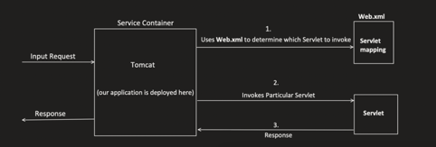  
  
  
 * consist of web.xml in which servlet-mapping is done which is kind of boilerplate and unnecessary    
Q2) How spring framework solve challenges which exists in servlet?  
1. Removal of web.xml  
    * Web.xml overtime becomes too big and becomes very difficult to manage  
    * Spring framework introduced Annotation based configuration  
  
2. Inversion of Control (IoC)  
    * Servlet depends on servlet container to create object and maintain it’s lifecycle  
    * IOC is more flexible way to manage object dependencies and it’s lifecycle through dependency injection  
  
3. Unit Testing  
    * As the object creation depends on servlet container mocking it is not easy  
    * With spring dependency injection unit testing becomes easy  
  
4. Difficult to manage rest APIs  
  
Q3) What is IoC  
	  
Let’s see **example without Dependency Injection **  
Payment class is creating an instance of User class, and there is one Major problems with this and i.e.  
Tight coupling: Now payment class is tightly coupled with User class.  
How?  
- Suppose I want to write Unit test cases for Payment "getSenderDetails)" method, but now I can not easily MOCK "User" object, as Payment class is creating new object of User, so it will invoke the method of User class too.  
  
  
Example **with Dependency Injection**   
@Component: Tells spring that you have manage this class or bean  
@Autowired: tells spring to resolve and add this object dependent  
  
Q4) What is DispatcherServlet in spring  
Http request first goes to Dispatcher Servlet which decides which controller will handle the request   
  
Q5) How does spring solve challenges that exists with spring mvc  
  
 1. Dependency Management:   
  
No need for adding different dependencies separately and also their compatible version headache.   
  
2. Auto Configuration:   
No need for separately configuring "DispatcherServlet", "AppConfig" , "EnableWebMvc", "ComponentScan". Spring boot add internally by-default.   
  
3. Embedded Server:  
  
In traditional Spring MVC application, we need to build a WAR file, Then we need to deploy this WAR file to a servlet container like Tomcat.  
  
Note: war file is a packaged file containing your application's classes, JSP pages, configuration files, and dependencies  
  
But in Spring boot, Servlet container is already embedded  
  
Q6) What is spring boot?  
- It provides a quick way to create a production ready application.  
- It is based on Spring framework.  
- It support "Convention over Configuration".  
Use default values for configuration, and if developer don’t want to go with convention(the way something is done), they can override it.  
- It also help to run an application as quick as possible.  
  
  
Q7) What is Maven?  
- It’s a project management tool. Helps developers with:  
* Build generation  
* Dependency resolution  
* Documentation etc.  
- Maven uses POM (Project Object Model) to achieve this.  
  

| mvn validate

mvn compile
  validates and compiles code

mvn test
  validate, compile and run test cases

mvn package
  First complete Validate, Compile, Test phase and then run Package phase in which it 
  generates .jar or .war file.

mvn verify
  additional checks like static code analysis and checksum

mvn install
  installs .jar package in local maven repo

mvn deploy
  deploys .jar to remote location

maven repository default location (~/.m2/repository) |
| ------------------------------------------------------------------------------------------------------------------------------------------------------------------------------------------------------------------------------------------------------------------------------------------------------------------------------------------------------------------------------------------------------------------------------------------------------------------------------- |
  
Q7) What is bean?  
Bean is a java object which is managed by spring container.  
  
Q8) How to create bean?  
  
Two ways:  
* @Component  
* @Bean  
  
1. **Using @Component annotation:**  
* @Component annotation follows "convention over configuration" approach.  
* @Controller, @Service etc. all internally tells Spring to create bean and manage it.  
* 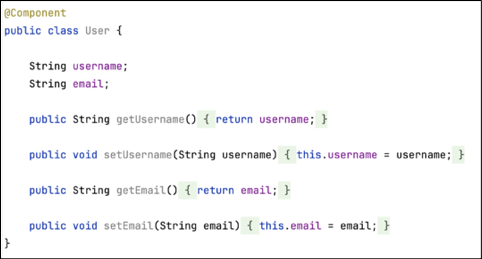  
  
   
  
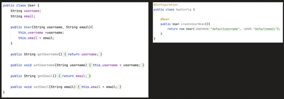  
  
  
  
  
Spring will internally call new User() here  
No need to create constructor - creating constructor will result in error  
  
2. **Using @Bean annotation**  
@Bean is used, when we provide configuration detail and tell spriing to use it while creating a bean  
Q9) How Spring find these beans?  
  
1. **Using @ComponentScan annotation**, it will scan the specified package and sub package for classes annotated with @Component, @Service etc.  
  
  
  
  
  
  
  
   
  
2. Through Explicit defining of bean **via @Bean annotation in @Configuration class**.  
  
Q10) Lifecycle of bean  
   
Q11) At what time beans get created   
  
  
Q12) What is Dependency Injection  
  
Dependency Injection is a design principle where a class does **not create its own dependencies**.
Instead, dependencies are **provided from an external source**.  
This helps:  
* Reduce tight coupling  
* Improve flexibility  
* Make code easier to test and maintain  
  
**Problem Scenario (Without DI)**  

| public class User {
    Order order = new Order();

    public User() {
        System.out.println("initializing user");
    }
}

public class Order {
    public Order() {
        System.out.println("initializing Order");
    }
} |
| ------------------------------------------------------------------------------------------------------------------------------------------------------------------------------------------------------------------------------------- |
  
```


```
**Issues with this approach**  
1. **Tight coupling**  
    * User is directly dependent on the concrete Order class.  
    * User controls how Order is created.  
2. **Poor flexibility**  
    * If Order changes (constructor logic, parameters, etc.), User must also change.  
3. **Violation of design principles**  
    * High-level class (User) depends on low-level implementation (Order).  
  
It breaks Dependency Inversion rule of **S.0.L.I.D principle**  
This principle says that DO NOT depend on concrete implementation, rather depend on abstraction  
  
  
  
**Future Problem (When Order becomes an Interface)**  

| public interface Order {
}

public class OnlineOrder implements Order {
}

public class OfflineOrder implements Order {
} |
| ------------------------------------------------------------------------------------------------------------------------- |
  
Now this becomes invalid:  

| Order order = new Order(); // ❌ cannot instantiate interface
So developers end up doing:

Order order = new OnlineOrder(); // or OfflineOrder |
| --------------------------------------------------------------------------------------------------------------------------------------------- |
  
**Why this is still a problem**  
* User must change whenever:  
    * A new implementation is added  
    * Business logic switches between implementations  
* Code becomes **hard to extend and maintain**  
  
**Core Design Issue**  
**Object creation logic is inside the User class**  
This causes:  
* Tight coupling  
* Frequent code changes  
* Difficult testing  
  
**Solution: Dependency Injection**  
Instead of creating the dependency:  

| Order order = new OnlineOrder();
Inject it from outside:

public class User {
    private Order order;

    public User(Order order) {
        this.order = order;
    }
} |
| -------------------------------------------------------------------------------------------------------------------------------------------------------------------------- |
  
Now:  
* User depends on the **abstraction (Order interface)**  
* User does not care which implementation it gets  
  
  
**Benefits of Dependency Injection**  
* Loose coupling between classes  
* Easy to switch implementations  
* Better testability (mock objects can be injected)  
* Code follows clean design principles  
  
  
Q13) Types of dependency Injection  
Spring supports three types of dependency injection:   
* Constructor injection  
* Setter injection  
* Field injection.  
  
**1. Constructor Injection (**✅** Preferred)**  
Dependencies are provided through the **constructor**. Constructor injection is preferred because it makes the class immutable and ensures all dependencies are available at creation time.  
  
**Why it exists**  
* Makes dependencies mandatory  
* Ensures immutability  
* Easier unit testing  
* No partially constructed objects  
  
**Example**  

| @Service
class OrderService {

    private final PaymentService paymentService;

    OrderService(PaymentService paymentService) {
        this.paymentService = paymentService;
    }
} |
| ---------------------------------------------------------------------------------------------------------------------------------------------------------------------------------------- |
  
**How Spring works internally**  
* Spring creates PaymentService first  
* Then calls the constructor of OrderService  
* Injects the dependency at creation time  
  
  
**Setter Injection (**⚠️** Use when dependency is optional)**  
* Allows optional dependencies  
* Allows dependency to be changed later  
  
**Example**  

| @Service
class NotificationService {

    private EmailService emailService;

    @Autowired
    public void setEmailService(EmailService emailService) {
        this.emailService = emailService;
    }
} |
| ----------------------------------------------------------------------------------------------------------------------------------------------------------------------------------------------------------- |
  
```


```
**How Spring works internally**  
* Spring creates the object using default constructor  
* Then calls the setter method  
* Injects the dependency after object creation  
**Downsides**  
* Object can exist in incomplete state  
* Mutability  
  
  
3️⃣** Field Injection (**❌** Not Recommended)**  
**What it is**  
Dependencies are injected directly into fields.  
**Example**  

| @Service
class UserService {

    @Autowired
    UserRepository userRepository;
} |
| --------------------------------------------------------------------------------- |
  
```


```
**Why it’s discouraged**  
* Hard to unit test  
* Hidden dependencies  
* Uses reflection  
* Breaks immutability  
  
**Comparison Table (very interview-friendly)**  

| Type        | When injected      | Mutable | Test-friendly | Recommended |
| ----------- | ------------------ | ------- | ------------- | ----------- |
| Constructor | At object creation | ❌       | ✅             | ✅ Yes       |
| Setter      | After creation     | ✅       | ⚠️             | Sometimes   |
| Field       | After creation     | ✅       | ❌             | ❌ No        |
  
  
  
If a class has only one constructor, @Autowired is optional.  
  
Q14) What happens if multiple beans of the same type exist?  
Spring throws ****NoUniqueBeanDefinitionException****.
We resolve it using ****@Qualifier**** or ****@Primary.****  

| @Autowired
@Qualifier("fastService")
PaymentService service; |
| ------------------------------------------------------------ |
  
Q15) What is Bean Scope in Spring?  
Bean scope defines the lifecycle and visibility of a bean—how many instances Spring creates and how long they live.
Scope tells Spring **when to create**, **how many to create**, and **when to destroy** a bean.  
1️⃣ Default Scope: ****singleton**** (most important)  
Singleton scope means one bean per Spring container, not per JVM.  

| @Service
class UserService {}
This is implicitly:

@Scope("singleton") |
| ---------------------------------------------------------------------- |
  
```
2️⃣ prototype Scope

```

| @Component
@Scope("prototype")
class ReportGenerator {} |
| ------------------------------------------------------- |
  
Spring creates the object, but **does NOT manage its destruction**.  
  
3️⃣** request Scope (Web apps only)**  
One bean per HTTP request.  
```
@Component
@Scope(value = WebApplicationContext.SCOPE_REQUEST)
class RequestData {}

```
  
**Use case**  
Storing request-specific data.  
  
4️⃣** session Scope (Web apps only)**  
One bean per HTTP session (per user).  
```
@Component
@Scope(value = WebApplicationContext.SCOPE_SESSION)
class UserSession {}

```
  
```
5️⃣ application Scope

```
One bean per ServletContext.  

| @Component
@Scope(value = WebApplicationContext.SCOPE_APPLICATION)
class AppConfigCache {} |
| ------------------------------------------------------------------------------------------ |
  
  
6️⃣** websocket Scope (rare)**  
One bean per WebSocket session.  
  
**Comparison Table (interview-friendly)**  

| Scope       | Instances | Lifetime     |
| ----------- | --------- | ------------ |
| singleton   | 1         | Entire app   |
| prototype   | Many      | Until GC     |
| request     | 1/request | HTTP request |
| session     | 1/session | User session |
| application | 1/app     | App lifetime |
  
Q16) Unsatisfied dependency problem   
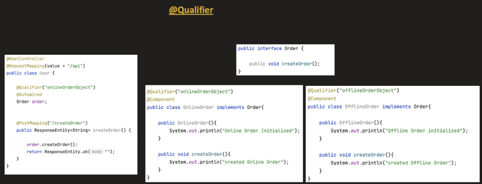  
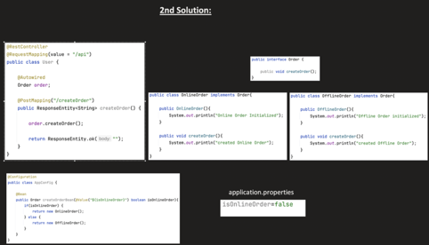  
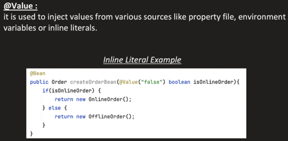  
  
Q17) @ConditionalOnProperty  
Bean is created conditionally (means bean can be created or not).  
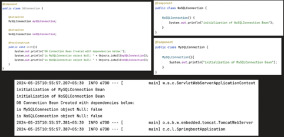  
  
**Use case 1:**  
We want to create only 1 Bean, either MySQLConnection or NoSQLConnection.  
  
**Use case 2:**  
We have 2 components, sharing same codebase, But 1 component need  
MYSQLConnection and other needs NoSQLConnection  
  
*Solution: Use @ConditionalOnProperty*  
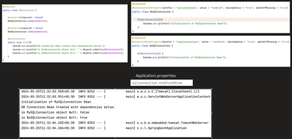  
  
  
Q18)  @Profile  
To set environment variable (like dev, prod etc)  
Add profiles in pom.xml  
create env file with application-dev.prop  
  
Q19) AOP (Aspect oriented programming)  
It helps to Intercept the method invocation. And we can perform some task before and  
after the method.  
  
Used during:  
* Logging  
* Transaction Management  
* Security etc..  
  
Dependency in pom.xml  

| <dependency>
<groupld>org.springframework.boot</groupld>
<artifactld>spring-boot-starter-aop</artifactld>
</dependency> |
| ----------------------------------------------------------------------------------------------------------------------- |
  
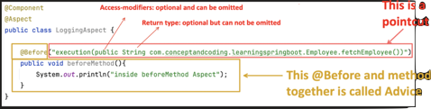  
Q20)Types of pointcut  
  
1. **Execution**: matches a particular method in a particular class.  

| @Before("execution(public String com.conceptandcoding.learningspringboot.Employee.fetchEmployee())") |
| ---------------------------------------------------------------------------------------------------- |
  
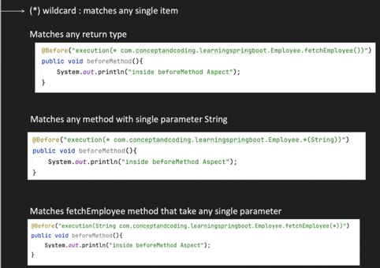  
  
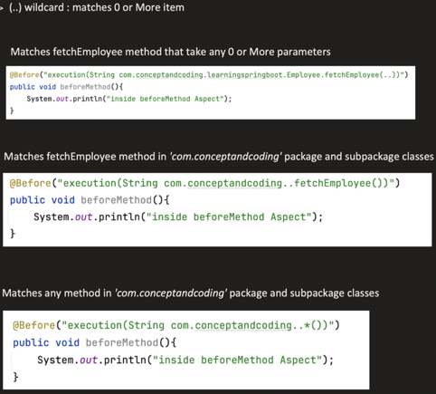  
  
  
2. **Within**: matches all method within any class or package.  
  
This pointcut will run for each method in the class Employee  

| @Before("within(com.conceptandcoding.learningspringboot.Employee)") |
| ------------------------------------------------------------------- |
  
This pointcut will run for each method in this package and sub-package  

| @Before("within(com.conceptandcoding.learningspringboot..*)") |
| ------------------------------------------------------------- |
  
  
  
  
  
  
  
  
3. **@within**: matches any method in a class which has this annotation.  
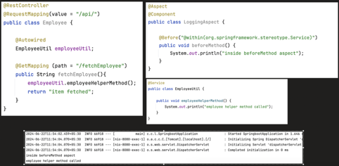  
  
4. **@annotation**: matches any method that is annotated with given annotation  
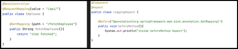  
  
5. **Args**: matches any method with particular arguments (or parameters)  

| @Before("args(String,int)") |
| --------------------------- |
  
If instead of primitive type, we need object, then we can give like this  

| @Before("args(com.conceptandcoding.learningspringboot.Employee)") |
| ----------------------------------------------------------------- |
  
6. **@args**: matches any method with particular parameters and that parameter class is annotated with particular annotation.  

| @Before("@args(org.springframework.stereotype.Service)") |
| -------------------------------------------------------- |
  
  
  
  
  
  
  
  
  
  
7. **target**: matches any method on a particular instance of a class.  
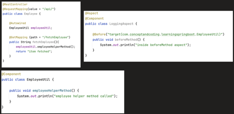  
  
Combining two pointcuts using:  
&& (boolean and)  
|| (boolean or)  
    
  
  
  
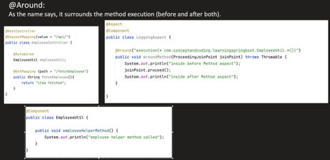  
  
  
Q21) What is **@Transactional**  
@Transactional defines a transaction boundary. It ensures that a group of database operations either all succeed or all fail together.  
  
* When multiple request try to access a critical section, data Inconsistency can happen.  
* Its solution is usage of TRANSACTION  
* It helps to achieve ACID property.  
  
  
   
  
**Transaction propogation**  
When we try to create a new Transaction, it first check the **PROPAGATION** value set, and this tell whether we have to create new transaction or not.  
  
```
1. REQUIRED (default propagation):

@Transactional(propagation=Propagation.REQUIRED)
	if(parent txn present)
		Use it;
	else
		Create new transaction;

```
  
```
2. REQUIRED_NEW:

@Transactional(propagation=Propagation.REQUIRED_NEW)
	if(parent txn present)
		Suspend the parent txn;
		Create a new Txn and once finished;
		Resume the parent txn;
	else
		Create new transaction and execute the method;

```
  
```
3. SUPPORTS:

@Transactional(propagation=Propagation.SUPPORTS)
	if(parent txn present)
		Use it;
	else
		Execute the method without any transaction;

```
  
```
4. NOT_SUPPORTED:

@Transactional(propagation=Propagation.NOT_SUPPORTED)
	if(parent txn present)
		Suspend the parent txn;
		Execute the method without any transaction;
		Resume the parent txn;
	else
		Execute the method without any transaction;

```
  
```
5. MANDATORY:

@Transactional(propagation=Propagation.MANDATORY)
	if(parent txn present)
		Use it;
	else
		Throw exception;

```
  
```
6. NEVER:

@Transactional(propagation=Propagation.NEVER)
	if(parent txn present)
		Throw exception;
	else
		Execute the method without any transaction;

```
  
   
```


```
Q22) ThreadPoolExecutor  
In java thread pool is created using ThreadPoolExecutor  
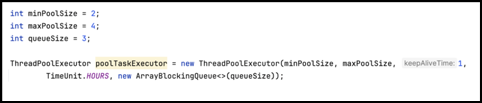  
  
Q23) Async annotation  
- Used to mark method that should run asynchronously.  
- Runs in a new thread, without blocking the main thread.  
  
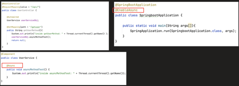  
  
If we see Spring boot framework code, it first looks for **defaultExecutor**, if no **defaultExecutor** found, only then **SimpleAsyncTaskExecutor** is used.  
  
Q24) It is not recommended at all to use "SimpleAsyncTaskExecutor", why?  
  
It just creates new thread every time. So it may lead to  
  
1. **Thread Exhaustion**: just blindly creating new thread with every Async request, might lead up to  
thread exhaustion.  
  
2. **Thread Creation Overhead**: Since Threads are not reused, so thread management (creation, destroying) is an additional overhead.  
  
3. **High Memory Usage:** Each threads need some memory, when we are creating these many threads, which may consume large amount of memory too, which might lead to performance degradation too.  
  
