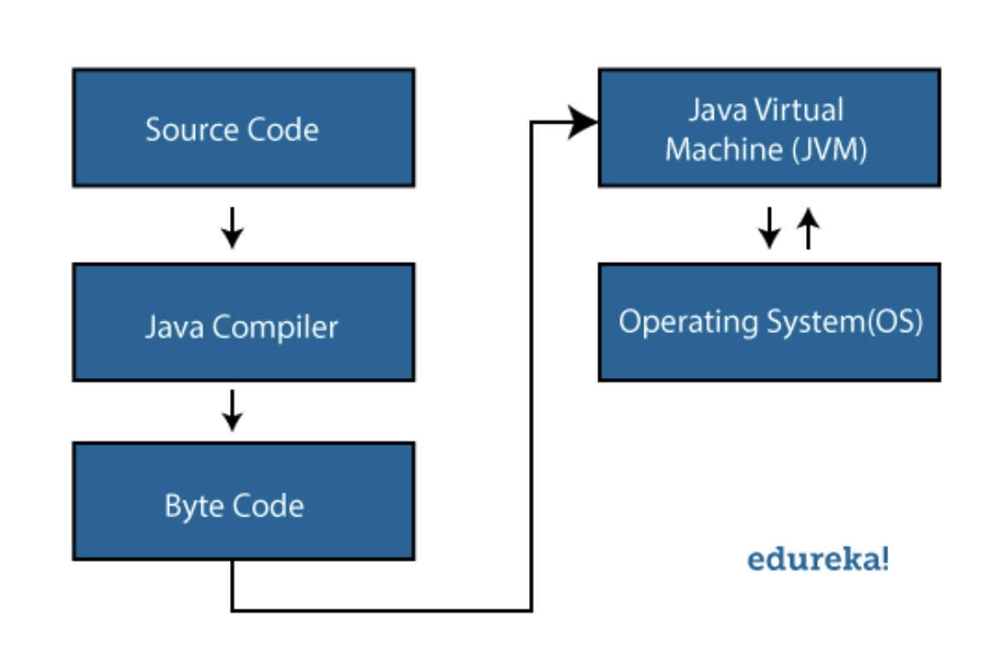
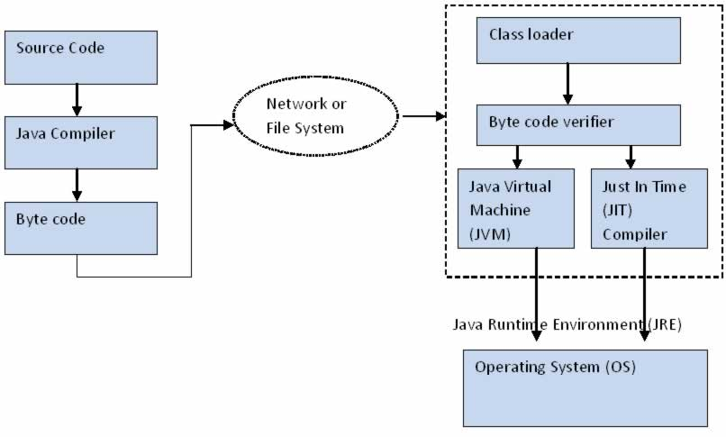

# 📘 Day 1: JVM, Memory, Setup  
  
## 1. Theory: JVM Architecture  
  
  
  
  
**JVM (Java Virtual Machine)**  
* Executes Java **bytecode** (.class files)  
* Makes Java **platform-independent**  
* Handles memory, threads, GC  
  
**JRE (Java Runtime Environment)**  
* JVM + core libraries  
* Needed to **run** Java applications  
  
**JDK (Java Development Kit)**  
* JRE + compiler (javac) + dev tools  
* Needed to **develop** Java applications  
  
  
## JVM Internals (Very Important for Interviews)  
**1. Class Loader**  
* Loads .class files into memory  
* Follows **parent delegation model**  
* Prevents overriding core Java classes  
  
1.  Bootstrap ClassLoader (Primordial ClassLoader):  
    * machine code responsible for initiating the JVM's operations.  
    * In Java <= 8, it loaded core Java files from rt.jar.   
    * Java > 8, it loads core Java files from the Java Runtime Image (JRT).  
    * operates independently without any parent ClassLoaders.  
  
1. Platform Class Loader (Extension ClassLoader):  
    * In Java <= 8, there was an Extension ClassLoader  
    * Java 9 onwards, it's referred to as the Platform Class Loader.  
    * Loads platform-specific extensions from the JDK's module system.  
    * Platform Class Loader loads files from the Java runtime image or from any other module specified by the system property java.platform or --module-path.  
  
3. System ClassLoader (Application ClassLoader):  
    * Also known as the Application ClassLoader  
    * it loads classes from the application's classpath.  
    * It is a child of the Platform Class Loader.  
    * Classes are loaded from directories specified by the environment variable CLASSPATH, the -classpath or -cp command-line option.  
  
  
**2. Runtime Data Areas**  
**Heap**  
* Objects live here  
* Shared across threads  
* Managed by **Garbage Collector**  
  
**Stack**  
* Each thread has its own stack  
* Stores:  
    * Method calls  
    * Local variables  
    * References  
* Automatically cleared when method ends  
  
**Method Area / Metaspace**  
* Class metadata  
* Static variables  
* Method bytecode  
(Java 8+: Metaspace instead of PermGen)  
  
**3. Execution Engine**  
* Interprets bytecode  
* Uses **JIT (Just-In-Time compiler)** to optimize hot code  
  
**4. Garbage Collector (GC)**  
* Automatically frees unused objects  
* Runs in background  
* Can cause **Stop-The-World (STW)** pauses  
  
5. JIT (Just in time compiler)  
Converts frequently executed bytecode to native machine language on runtime which makes java program to run faster  
  
## 2. Memory Management  
**Stack**  
* Fast  
* Per-thread  
* Memory freed automatically  
  
**Heap**  
* Slower  
* Shared  
* Objects stored here  
* Cleaned by GC  
  
**GC Roots**  
GC starts from:  
* Local variables in thread stacks  
* Static variables  
* Active method parameters  
* JNI references  
If an object is **reachable from GC Roots → alive**
If not → **eligible for GC**  
  
**Stop-the-World (STW) Pause**  
* JVM pauses all application threads  
* GC performs memory cleanup  
* Common interview question  
  
  
## 3. Coding Exercise: MemoryDemo  
Run this and **observe memory behavior**.  
```
public class MemoryDemo {
    public static void main(String[] args) {

        // Stack: primitive variable
        int x = 10;

        // Heap: object creation
        String s = new String("Hello");

        Runtime runtime = Runtime.getRuntime();

        System.out.println("Total Memory: " + runtime.totalMemory());
        System.out.println("Free Memory: " + runtime.freeMemory());

        // Allocate many objects
        for (int i = 0; i < 100000; i++) {
            String temp = "Num" + i;
        }

        System.out.println("Used Memory after loop: " +
                (runtime.totalMemory() - runtime.freeMemory()));
    }
}

```
👉 Now:  
* Add System.gc() before printing memory  
* Observe memory difference  
* Understand that GC is **not guaranteed**, only suggested  
  
## 5. How does GC know what to delete?  
**Answer: Reachability Analysis**  
GC **does not** use reference counting.  
  
**Step 1: Identify GC Roots**  
* Thread stack variables  
* Static variables  
* Active references  
**Step 2: Traverse references**  
* GC follows object references  
* Marks reachable objects as alive  
**Step 3: Collect garbage**  
* Unreachable objects → eligible for GC  
  
**Example**  
```
public class GCExample {
    static Object staticRef;

    public static void main(String[] args) {
        Object a = new Object();
        Object b = new Object();

        staticRef = new Object();

        a = null;
        b = null;

        System.gc();
    }
}

```
* a, b → eligible for GC  
* staticRef → NOT eligible (GC root)  
  
**Interview-Ready Answer**  
GC uses reachability analysis. Objects reachable from GC roots are kept alive; unreachable objects are collected. Cyclic references don’t cause memory leaks.  
  
## 6. What does “GC doesn’t rely on reference counting” mean?  
**Reference Counting Problem**  
Two objects reference each other → count never becomes zero → memory leak.  
**Why Java is safe**  
* Java checks **reachability**, not reference count  
* Cyclic objects without GC roots are collected  
  
## 7. Common Java Memory Leak Traps (Interview Gold)  
1. Static collections  
2. Unclosed resources  
3. Listeners not removed  
4. Non-static inner classes  
5. ThreadLocal misuse  
6. Caches without eviction  
👉 GC cannot free objects that are **still referenced**.  
  
## 8.  Record class in Java (16+)  
A **record** in Java is a compact way to define a class whose whole purpose is to **carry data**.  
```
public record User(String name, int age) {}

```
  
That single line quietly generates a lot of code for you.  
You automatically get:  
* private final fields  
* a canonical constructor  
* getters named exactly after the fields (name(), age())  
* equals(), hashCode(), and toString()  
  
## 9. Object class   
👉 Every class you create **automatically extends Object**, even if you don’t write it.  
  
It provides **common behavior for all objects**, such as:  
* comparing objects  
* hashing  
* string representation  
* thread synchronization  
* cloning  
* finalization  
This gives Java a **uniform object model**.  
  

| Method      | Purpose                |
| ----------- | ---------------------- |
| toString()  | String representation  |
| equals()    | Logical equality       |
| hashCode()  | Hash-based collections |
| wait()      | Pause thread           |
| notify()    | Wake one thread        |
| notifyAll() | Wake all threads       |
| getClass()  | Runtime metadata       |
| clone()     | Copy object            |
  
  
HashCode  
```
hashCode()

```
Used by hash-based collections (HashMap, HashSet).  
Rule:  
If equals() is overridden, hashCode() MUST also be overridden.  
  
4️⃣ wait(), notify(), notifyAll()  
Used for **inter-thread communication**.  
```
synchronized(obj) {
    obj.wait();
}

```
Important:  
👉 These belong to Object, NOT Thread.  
Because every object can act as a **monitor lock**.  
  
## 5️⃣ getClass()  
Returns runtime class info.  
```
obj.getClass();

```
Used in reflection.  
  
## 6️⃣ clone() (protected)  
Creates shallow copy.  
```

Employee copy = (Employee) emp.clone();

```
Requires implementing Cloneable.  
Rarely used in modern code.  
