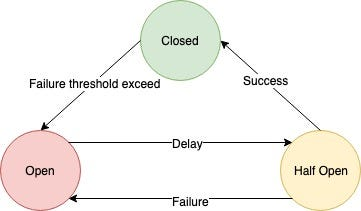
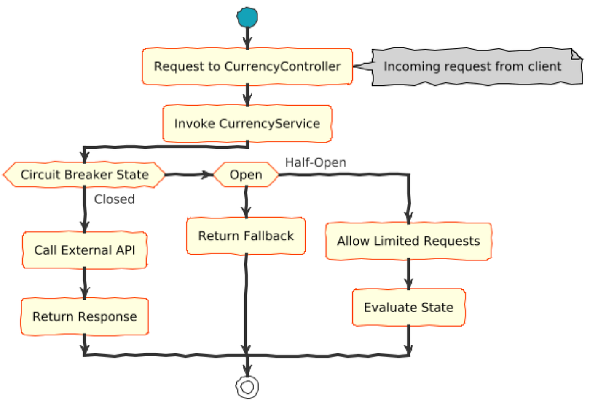
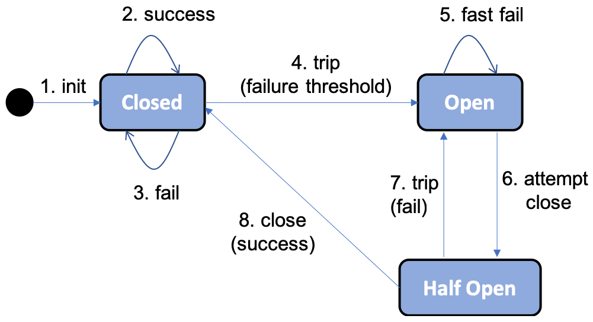

# 📘 2. Circuit Breaker   
  
Circuit Breaker prevents cascading failures by stopping calls to unhealthy services and allowing them time to recover.  
  
# Design Pattern  
  
  
## The 3 States of Circuit Breaker  
**1️⃣ CLOSED (Normal)**  
* Requests flow normally  
* Failures are counted  
If failures cross threshold → OPEN  
  
**2️⃣ OPEN (Fail Fast)**  
* All requests blocked immediately  
* Optional fallback returned  
After wait time → HALF-OPEN  
  
**3️⃣ HALF-OPEN (Test Mode)**  
* Allow few test requests  
If success → CLOSED
If failure → OPEN again  
  
  
Sure — here’s a **practical Spring Boot @CircuitBreaker example** using **Resilience4j** (the modern replacement for Hystrix).  
  
  
  
  
4  
# ✅ Spring Boot @CircuitBreaker Example (Resilience4j)  
We’ll simulate:  
```

Order Service → Payment Service

```
When Payment fails → Circuit Breaker opens → fallback is returned.  
  
## 1️⃣ Add Dependencies (Maven)  
```

<dependency>
    <groupId>org.springframework.boot</groupId>
    <artifactId>spring-boot-starter-web</artifactId>
</dependency>

<dependency>
    <groupId>io.github.resilience4j</groupId>
    <artifactId>resilience4j-spring-boot3</artifactId>
</dependency>

<dependency>
    <groupId>org.springframework.boot</groupId>
    <artifactId>spring-boot-starter-aop</artifactId>
</dependency>

```
  
## 2️⃣ application.yml  
```

resilience4j:
  circuitbreaker:
    instances:
      paymentService:
        registerHealthIndicator: true
        slidingWindowSize: 5
        failureRateThreshold: 50
        waitDurationInOpenState: 10s
        permittedNumberOfCallsInHalfOpenState: 2

```
Meaning:  
* Check last **5 calls**  
* If **50% fail** → OPEN  
* Stay OPEN for **10 seconds**  
* Allow **2 test calls** in HALF-OPEN  
  
## 3️⃣ Service Layer with @CircuitBreaker  
```

@Service
public class PaymentService {

    @CircuitBreaker(name = "paymentService", fallbackMethod = "paymentFallback")
    public String callPayment() {
        // Simulate failure
        if (true) {
            throw new RuntimeException("Payment service down");
        }
        return "Payment Success";
    }

    // Fallback method
    public String paymentFallback(Throwable t) {
        return "Payment service unavailable. Please try later.";
    }
}

```
  
## 4️⃣ Controller  
```

@RestController
public class OrderController {

    @Autowired
    private PaymentService paymentService;

    @GetMapping("/order")
    public String placeOrder() {
        return paymentService.callPayment();
    }
}

```
  
# 🧪 What Happens at Runtime  
**First few requests:**  
```

callPayment() throws exception
failure count increases

```
  
**After threshold crossed:**  
```

Circuit → OPEN
paymentFallback() called directly
(no remote call)

```
  
**After 10 seconds:**  
```

HALF-OPEN
few test calls allowed

```
If successful → CLOSED
If failed → OPEN again  
