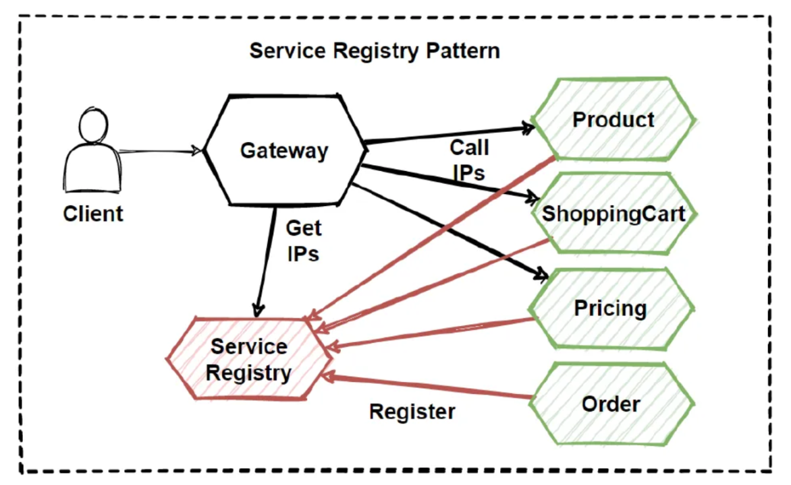

# 📘 3. Microservice Architecture  
  
Microservice architecture is a design style where an application is built as a collection of small, independent services that communicate over APIs. Each service is responsible for a single business capability and can be developed, deployed, and scaled independently.  
  
  
  
# 🧠 Key Idea  
Instead of ONE big application (monolith):  
```
Single codebase
Single deployment
Single database

```
You build:  
```
Many small services
Independent deployments
Database per service

```
Example:  
```
User Service
Order Service
Payment Service
Inventory Service

```
Each runs separately.  
  
  
# 🔑 Core Characteristics  
  
**1️⃣ Independent Deployment**  
Each service can be deployed without touching others.  
  
**2️⃣ Single Responsibility**  
Every service does **one business job**.  
  
**3️⃣ Decentralized Data**  
Each service owns its own database.  
  
**4️⃣ Communication via APIs**  
Usually REST or messaging.  
  
**5️⃣ Technology Agnostic**  
Different services can use different stacks.  
  
  
# ⚙️ Typical Components  
  
**🔹 API Gateway**  
Single entry point for clients.  
  
**🔹 Service Discovery**  
Finds service instances dynamically.  
  
**🔹 Load Balancer**  
Distributes traffic.  
  
**🔹 Config Server**  
Centralized configuration.  
  
**🔹 Monitoring & Logging**  
