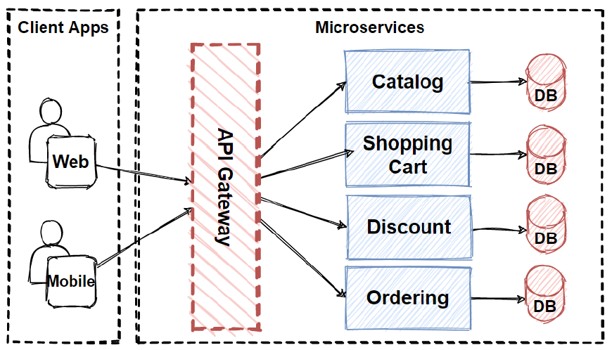
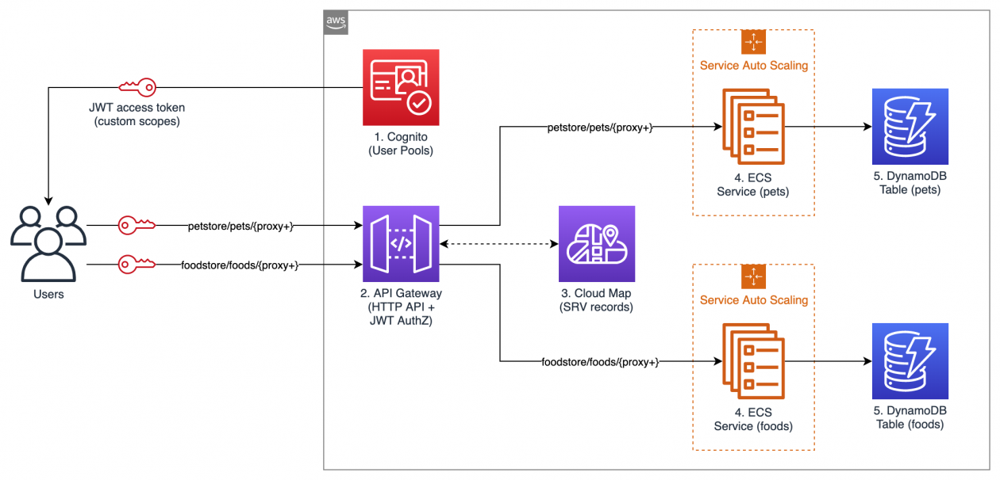
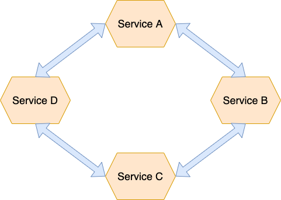

# 📘 4. Call one Microservice from another  
#   
# ⭐ Interview One-liner  
In Spring Boot microservices, we usually call another service via REST using WebClient or Feign Client, with Feign being preferred for declarative communication.  
  
  
  
  
  
At a high level:  
```

Service A  →  HTTP/REST  →  Service B

```
Usually via:  
* REST API  
* Sometimes Messaging (Kafka/RabbitMQ)  
In Java microservices (Spring Boot), the **most common ways** are:  
1. RestTemplate (older)  
2. WebClient (modern, reactive)  
3. Feign Client (declarative — easiest)  
  
  
🥉**** Option 1 — RestTemplate (Legacy but still asked)****  
```
@RestController
public class PaymentController {

    @GetMapping("/payment")
    public String payment() {
        return "Payment Success";
    }
}

```
  
**Service A (Caller)**  
```
@Service
public class OrderService {

    @Autowired
    private RestTemplate restTemplate;

    public String callPayment() {
        return restTemplate.getForObject(
                "http://localhost:8081/payment",
                String.class);
    }
}

```
  
Bean:  
```
@Bean
public RestTemplate restTemplate() {
    return new RestTemplate();
}

```
  
# 🥈 Option 2 — WebClient (Modern)  
```
@Service
public class OrderService {

    private final WebClient webClient = WebClient.create();

    public String callPayment() {
        return webClient.get()
                .uri("http://localhost:8081/payment")
                .retrieve()
                .bodyToMono(String.class)
                .block();
    }
}

```
  
# 🥇 Option 3 — Feign Client (BEST for Microservices)  
Uses **OpenFeign**  
You just define an interface — no HTTP code.  
  
## Step 1: Dependency  
```
<dependency>
    <groupId>org.springframework.cloud</groupId>
    <artifactId>spring-cloud-starter-openfeign</artifactId>
</dependency>

```
  
## Step 2: Enable Feign  
```
@EnableFeignClients
@SpringBootApplication
public class OrderApplication {}

```
  
## Step 3: Create Client Interface  
```
@FeignClient(name = "payment-service", url = "http://localhost:8081")
public interface PaymentClient {

    @GetMapping("/payment")
    String callPayment();
}

```
  
## Step 4: Use It  
```
@Service
public class OrderService {

    @Autowired
    private PaymentClient paymentClient;

    public String placeOrder() {
        return paymentClient.callPayment();
    }
}

```
  
  
