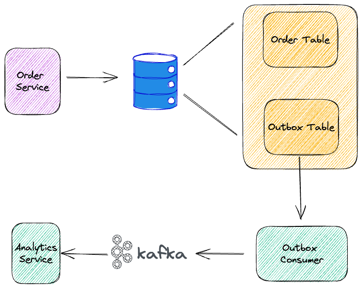
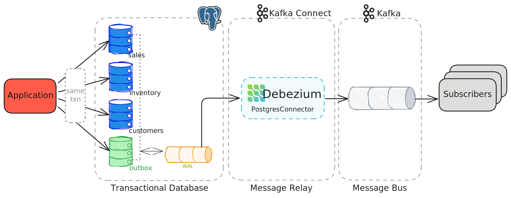
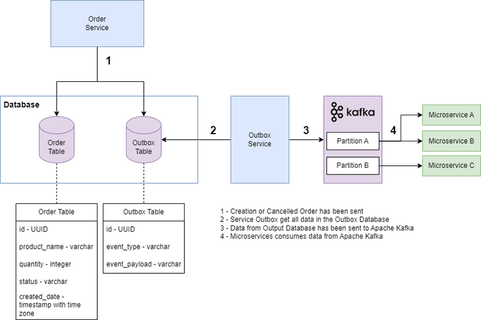

## 📦 What is the Outbox Pattern?  
  
👉 The Outbox Pattern guarantees **data consistency between your database and Kafka** by writing events to a local **outbox table** in the *same DB transaction* as your business data — then publishing those events to Kafka asynchronously.  
In short:  
**Save business data + save event together → publish event later**  
No lost messages. No half-updated systems.  
  
## ❌ The problem it solves (without Outbox)  
Imagine this flow:  
```
Save Order to DB  ✅
Publish Kafka Event ❌ (Kafka down)

```
Now:  
* Order exists in DB  
* Other services never hear about it  
💥 System is inconsistent.  
Or the reverse:  
```
Kafka Event sent ✅
DB insert failed ❌

```
Now consumers think order exists — but it doesn’t.  
This is called the **Dual Write Problem**.  
  
## ✅ Outbox Pattern Solution  
You **never write directly to Kafka inside business logic**.  
Instead:  
1. Write business data  
2. Write event into OUTBOX table  
3. Commit DB transaction  
4. Background publisher sends events to Kafka  
5. Mark outbox row as SENT  
All in one safe flow.  
  
## Visual flow  
  
  
  
4  
  
## 🧠 Step-by-step (Order example)  
**1️⃣ Inside ONE DB transaction:**  
```


Insert into orders
Insert into outbox_events
COMMIT


```
Now both are guaranteed.  
  
**2️⃣ Background publisher (or Debezium):**  
Reads outbox table:  
```


SELECT * FROM outbox_events WHERE status='NEW'


```
Publishes to Kafka.  
  
**3️⃣ Marks event as SENT**  
```


UPDATE outbox_events SET status='SENT'


```
  
## 🔥 Simple Java Example  
**Outbox Table**  
```


CREATE TABLE outbox (
  id UUID,
  topic VARCHAR,
  payload JSON,
  status VARCHAR
);


```
  
**Service Layer**  
```


@Transactional
public void createOrder(Order order) {

    orderRepository.save(order);

    OutboxEvent event = new OutboxEvent(
            UUID.randomUUID(),
            "order-topic",
            objectMapper.writeValueAsString(order),
            "NEW");

    outboxRepository.save(event);
}


```
  
**Publisher Job**  
```


@Scheduled(fixedDelay = 5000)
public void publish() {

    List<OutboxEvent> events = outboxRepository.findNew();

    events.forEach(e -> {
        kafkaTemplate.send(e.getTopic(), e.getPayload());
        e.setStatus("SENT");
        outboxRepository.save(e);
    });
}


```
  
## ⚡ Why this works  
Because:  
✅ DB write + outbox write are atomic
✅ Kafka publishing is retriable
✅ No distributed transactions
✅ Survives crashes
✅ Works with Saga
✅ Production proven  
  
## 🆚 Kafka Transactions vs Outbox  
Very important interview distinction:  

| Kafka Transaction  | Outbox Pattern      |
| ------------------ | ------------------- |
| Producer level     | Database level      |
| Short lived        | Durable             |
| Kafka only         | Any broker          |
| Doesn’t protect DB | Protects DB + event |
| Less reliable      | Most reliable       |
  
👉 **Outbox is stronger.**  
Most real systems use Outbox.  
  
## 🎯 Interview one-liner (memorize)  
Outbox Pattern solves the dual-write problem by storing events in a database table within the same transaction as business data, then asynchronously publishing them to Kafka, ensuring reliable event delivery and eventual consistency.  
  
## 🏆 How it fits with Saga  
Usually:  
**✅ Outbox = reliable event publishing**  
**✅ Saga = business workflow coordination**  
